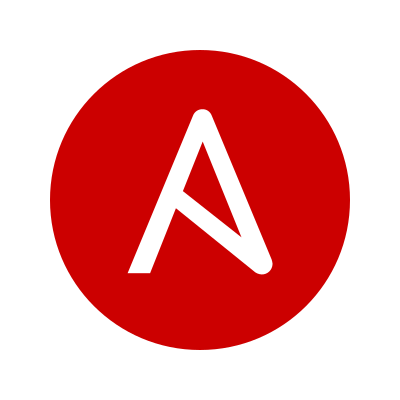

<h1 align="left" id="macropower-title">Hey there! I'm [Dan Gerkol]  </h1>
<h3 align="left">I am a DevOps Engineer, and an LGBTQ activist :heavy_heart_exclamation:</h3>

- 🏢 &nbsp;I'm currently working at **[Tufin]**
- 🌱 &nbsp;Currently, I'm expanding my knowledge of **Kubernetes**
- 🎗️  &nbsp;I like to volunteer for the **sake of doing good**
- ✨ &nbsp;**10+** years volunteering with **at-risk youth**
- 💻 &nbsp;Connect with me on **[LinkedIn]**

 

<h2 align="left" id="macropower-tech">Favorite Tech 💡</h2>

<b> I like to automate, cloud engineer and explore complex systems </b>
  
> Tools, languages, and other things that I like to work with:

<table align="center">
  <tr>
    <td align="center" width="96">
      
       AWS&nbsp;
    </td>
    <td align="center" width="96">
      
       Kubernetes
    </td>
    <td align="center" width="96">
      
       Jenkins
    </td>
    <td align="center" width="96">
      
       terraform
    </td>
    <td align="center" width="96">
      
       Python
    </td>
    <td align="center"  width="96">
      
       RHEL
    </td>
    <td align="center" width="96">
      
       Grafana
    </td
  </tr>
  <!-- Next row -->
  <tr>
    <td align="center" width="96">
      
       VMware
    </td>
    <td align="center" width="96"> 
      
       Docker
    </td>
    <td align="center" width="96">
      
       Ansible
    </td>
    <td align="center"  width="96">
      
       MySQL
    </td>
    <td align="center" width="96">
      
       Powershell
    </td>
    <td align="center"  width="96">
      
       Debian
    </td>
    <td align="center" width="96">
      
       Prometheus
    </td>
  </tr>
</table>

 

<h2 align="center">🤝 Support 🤝</h2>

🎀 Contributions (<a href="https://guides.github.com/introduction/flow" title="GitHub flow">GitHub Flow</a>), 🔥 issues, and 🥮 feature requests are most welcome!

💜 Spread the word of diversity ~ be <a href="https://www.linkedin.com/company/lgbtech/" title="part of the change">part of the change</a> at your organization!

 

<h1 align='center'>⚡️<i>Stay awesome!</i>⚡️</h1>

        

<!-- links -->

[Tufin]: https://www.tufin.com "Tufin Home"
[linkedin]: https://www.linkedin.com/in/dan-gerkol "Dan Gerkol LinkedIn"
[Dan Gerkol]: https://www.linkedin.com/in/dan-gerkol "Dan Gerkol LinkedIn"
